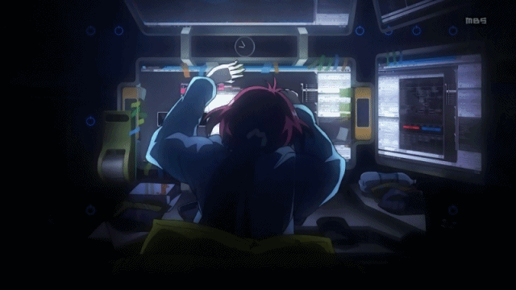

<div align="center">



<br/>

<a href="#"></a>

<p>
  
  
  
  
</p>

</div>

<br/>

```
$ cat about_me.txt
```

## 🧑‍💻 About me

- 🔭 Currently working with large-scale SaaS and microservices
- 🏗️ Experienced with legacy system modernization
- ☁️ Kubernetes, Docker and CI/CD
- 🤖 Building AI-powered applications with RAG and LLMs
- 👨‍💻 Mainly working with PHP/Laravel and Node.js

<br/>

```
$ ls tech_stack/
```

## 🛠️ Tech Stack

<p align="center">
  
</p>

<br/>

```
$ ./deploy.sh --project omnifiles
```

## 🚀 Featured Project

<table>
  <tr>
    <td valign="top">
      <h3>🔹 <a href="https://omnifiles.com.br/">Omnifiles</a></h3>
      <p>SaaS platform built with Laravel, featuring intelligent document processing powered by RAG (Retrieval-Augmented Generation), running on Laravel Cloud.</p>
      
      
      
      
    </td>
  </tr>
</table>

<br/>

```
$ nc -lvp 443 --contact
```

## 📫 Contact

<p align="center">
  <a href="https://www.linkedin.com/in/hiury-ronchi/"></a>
  <a href="mailto:hiurydev@icloud.com"></a>
</p>
